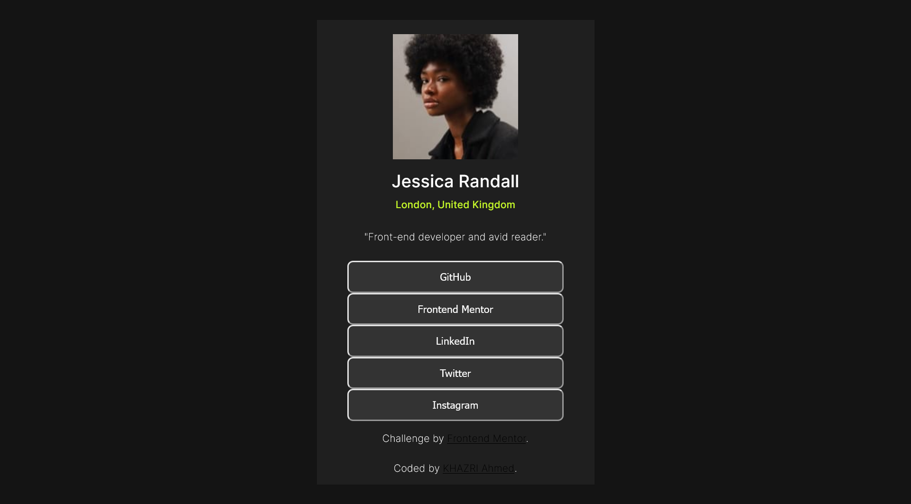
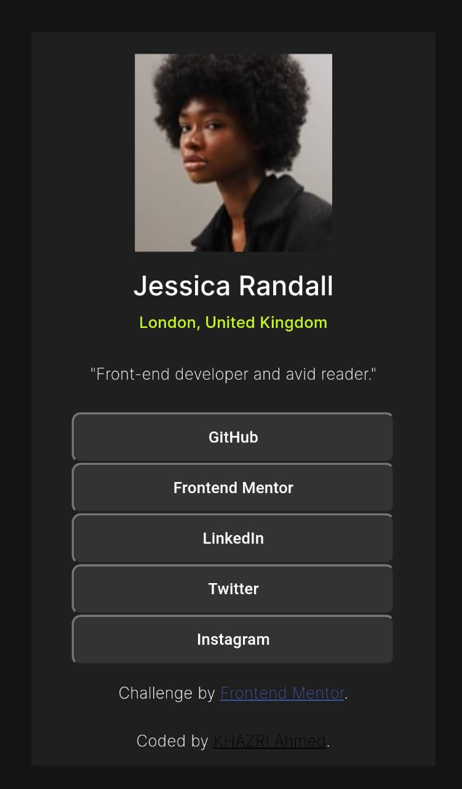

# Frontend Mentor - Social links profile solution

This is a solution to the [Social links profile challenge on Frontend Mentor](https://www.frontendmentor.io/challenges/social-links-profile-UG32l9m6dQ). Frontend Mentor challenges help you improve your coding skills by building realistic projects. 

## Table of contents

- [Overview](#overview)
  - [The challenge](#the-challenge)
  - [Screenshot](#screenshot)
  - [Links](#links)
- [My process](#my-process)
  - [Built with](#built-with)
  - [What I learned](#what-i-learned)
  - [Continued development](#continued-development)
  - [Useful resources](#useful-resources)
- [Author](#author)
- [Acknowledgments](#acknowledgments)


## Overview

### The challenge

Users should be able to:

- See hover and focus states for all interactive elements on the page

### Screenshot

Desktop screenshot

Mobile screenshot


### Links

- Solution URL: [github repo](https://github.com/AhmedKhazri/social-links-profile-main)
- Live Site URL: [live site](https://ahmedkhazri.github.io/social-links-profile-main/#)

## My process

### Built with

- Semantic HTML5 markup
- CSS custom properties
- desktop-first workflow

### What I learned
I learned how to declare global css variables :
```css
:root {
    --green: hsl(75, 94%, 57%);
    --white: hsl(0, 0%, 100%);
    --grey: hsl(0, 0%, 20%);
    --dark-grey: hsl(0, 0%, 12%);
    --off-black: hsl(0, 0%, 8%);
```


## Author

- Frontend Mentor - [@AhmedKhazri](https://www.frontendmentor.io/profile/AhmedKhazri)
- Twitter - [@ahmed95khazri](https://twitter.com/ahmed95khazri)


